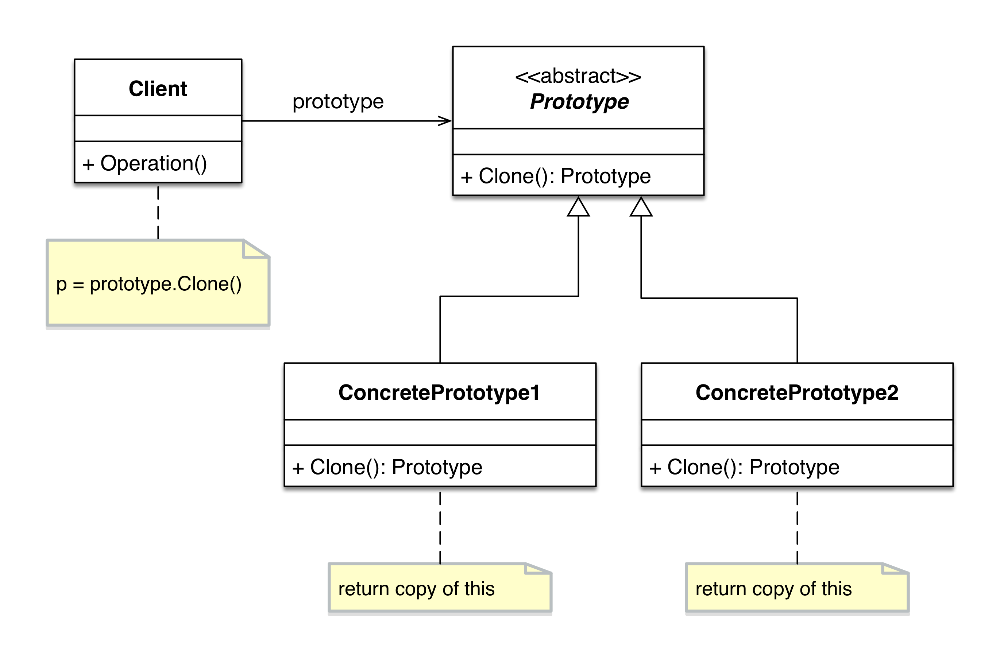
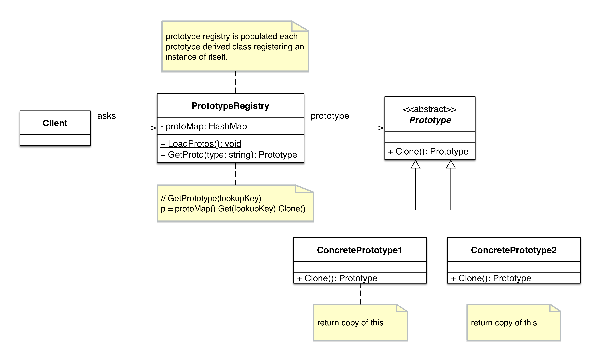

# Prototype Pattern

## Intent

Specifying the kind of objects to create using a prototypical instance, creating new objects by copying this prototype.

## Motivation

## Solution

## Check List

## Common uses

Declare an abstract base class that specifies a pure virtual "clone" method, and, maintains a dictionary of all "cloneable" concrete derived classes. Any class that needs a "polymorphic constructor" capability: derives itself from the abstract base class, registers its prototypical instance, and implements the clone() operation.

## Structure

- basic

- practical

## Sequence diagram

## References

- [dofactory](http://www.dofactory.com/net/prototype-design-pattern)
- [GoF] Gamma, Helm, Johnson, and Vlissides. Design Patterns: Elements of Reusable Object-Oriented Software. Addison-Wesley, 1995.
- [Design Patterns - Prototype Pattern](https://www.tutorialspoint.com/design_pattern/prototype_pattern.htm)
- [go design pattern](https://github.com/monochromegane/go_design_pattern/blob/master/prototype/prototype.go)