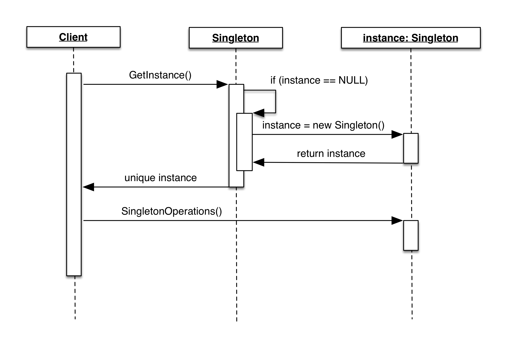

# Singleton Pattern

## Intent

- Ensure a class has **only one instance**, and provide a **global point** of access to it. [GoF] 
- Encapsulated "just-in-time initialization" or "initialization on first use".
- Lazy initialization and global access.


## Motivation

How do we ensure that a class has only one instance and that the instance is easily accessible? A global variable makes an object accessible, but it doesn't keep you from instantiating multiple objects.
**A better solution is to make the class itself responsible for keeping track of its sole instance**. [GoF] 

如何保證一個 Class 只有一個 instance 並且這個 instance 易於被訪問呢？讓 Class 自身負責保存它的**唯一** instance。這個 Class 可以保證沒有其他 instance 被創建，並且它可以提供一個訪問該 instance 的方法。

## Solution

- Declare the instance as a **private static data member**
- Provide a **public static member function** that encapsulate all initialization code (like a static factory).
- Provides access to the instace.

1. Constructor 為 private，用戶無法透過 new 去instantiate它
2. 提供一個自身的靜態私有變量
3. 提供一個公有的靜態工廠方法

## Check List

1. Define a **private static attribute** in the "single instance" class.
2. Define a **public accessor function** in the class.
3. Do "Lazy initialization" (creation on first use) in the accessor function.
4. Define all constructors to be **protected or private**.
5. Clients may only use the accessor functions to manipulate the Singleton (usually static functions).

## When to use it

- 大部分時間幾乎不用
- 要提供一個唯一的、公開的資源存取點。例如 GPIO 或者 Printer Task Queue.

## Trade-offs

- 不是 Thread safe 的
- 常被誤用為 Global Variable 的替代品

## Thread Safe implementation

通常用 Double-Check Locking 技巧解決

```csharp
// C# example from https://msdn.microsoft.com/en-us/library/ff650316.aspx
using System;

public sealed class Singleton
{
   private static volatile Singleton instance;
   private static object syncRoot = new Object();

   private Singleton() {}

   public static Singleton Instance
   {
      get 
      {
         if (instance == null) 
         {
            lock (syncRoot) 
            {
               if (instance == null) 
                  instance = new Singleton();
            }
         }

         return instance;
      }
   }
}
```

## Related Patterns

- Abstract Factory, Builder and Prototype 通常用 Singleton 實作
- Facase 與 State object 通常是 Singleton

## Class diagram


## Sequence diagram



## References

- [Implementing Singleton in C#](https://msdn.microsoft.com/en-us/library/ff650316.aspx)
- [GoF] Gamma, Helm, Johnson, and Vlissides. Design Patterns: Elements of Reusable Object-Oriented Software. Addison-Wesley, 1995.
- [圖說設計模式](http://design-patterns.readthedocs.io/zh_CN/latest/creational_patterns/singleton.html)
- [SOURCE MAKING](https://sourcemaking.com/design_patterns/singleton)
